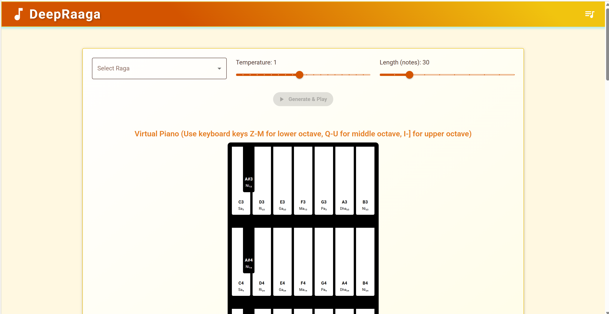

# DeepRaaga 🎵  
**An AI Framework for Learning and Generating Carnatic Ragas**

DeepRaaga is an open-source framework dedicated to modeling the intricate structural beauty of Carnatic music using Artificial Intelligence. By harmonizing traditional heritage with modern machine learning paradigms, we strive to build a computational bridge to India's rich musical legacy.

## 🌟 Vision: A National Knowledge Repository

Inspired by the visionary dialogue between PM Narendra Modi and veteran composer Ramesh Vinayakam on creating a "National Knowledge Repository" for Indian music, DeepRaaga stands as a foundational step toward that goal.

Carnatic music cannot be reduced to simple discrete notes; it is defined by the continuous, microtonal inflections (**Gamakas**), characteristic melodic pathways (**Sancharas**), and the strict grammatical constraints of ascending (**Arohana**) and descending (**Avarohana**) scales. Our mission is to encode this profound acoustic heritage into robust AI models, moving beyond Western-centric MIR (Music Information Retrieval) to create an open platform that respects, preserves, and innovates upon the grammar of Indian Classical Music.

## 1. Research Motivation

Carnatic music encodes melodic knowledge through ragas, which specify permitted swaras, characteristic phrases, and ornamentation patterns rather than fixed scores. Prior work in Music Information Retrieval (MIR) has focused mainly on Western genres, with comparatively fewer large-scale, open implementations for raga-centric modeling. [web:18][web:20]  

DeepRaaga aims to provide:  
- A reproducible pipeline from raw Carnatic MIDI/MusicXML to model-ready sequences.  
- Baseline sequence models for raga classification and raga-conditioned generation.  
- An extensible codebase that can support future work on swara-level modeling, tonic invariance, and improvisation analysis. [web:7][web:19]

## 2. System Overview

The project has two main subsystems:

- **Backend / Research pipeline (Python, TensorFlow, Magenta)**  
  - Data ingestion and conversion of Carnatic compositions (MIDI, MusicXML) into NoteSequence and TFRecord formats.  
  - Training of sequence models (RNN/LSTM or Transformer-style) on raga-labeled phrases.  
  - Scripts for evaluation (classification accuracy, phrase-level metrics) and sequence generation. [web:62][web:65]  

- **Frontend / Interaction layer (React + Vite)**  
  - `index.html` bootstraps a React SPA via `src/main.jsx`, mounting `App.jsx` at the `#root` div. [web:69][web:73]  
  - UI components under `src/components/` manage raga selection, model invocation (backend API hook), and audio playback of generated MIDI. [web:66]



Repository layout (simplified):

```
DeepRaaga/
├── base/          # Base classes, shared utilities
├── data/          # raw/ and processed/ Carnatic music data
├── docs/          # Concept notes and documentation
├── images/        # Diagrams, figures
├── model/         # Model definitions and training scripts
├── results/       # Generated outputs and logs
├── src/           # React front-end (App.jsx, main.jsx, components/)
├── test/          # Test scripts
├── index.html     # Front-end entry (Vite/React)
├── requirements.txt
└── package.json
```

## 3. Installation

### 3.1. Backend (Python)

```
git clone https://github.com/sgmoorthy/DeepRaaga.git
cd DeepRaaga

python -m venv .venv
source .venv/bin/activate   # Windows: .\.venv\Scripts\activate

pip install -r requirements.txt
```

`requirements.txt` typically includes TensorFlow, Magenta, librosa, pretty-midi, midi2audio, and related audio/MIR tooling. [web:59][web:68]

### 3.2. Frontend (React)

```
npm install        # or: pnpm install / yarn install
npm run dev        # local development
npm run build      # production build
```

`index.html` loads `src/main.jsx` as a module entry point and mounts the React app at `#root`. [web:69][web:73]

```
<!DOCTYPE html>
<html lang="en">
  <head>
    <meta charset="UTF-8" />
    <meta name="viewport" content="width=device-width, initial-scale=1.0" />
    <title>DeepRaaga - AI Carnatic Music Generator</title>
    <link
      rel="stylesheet"
      href="https://fonts.googleapis.com/css2?family=Roboto:wght@300;400;500;600;700&display=swap"
    />
  </head>
  <body>
    <div id="root"></div>
    <script type="module" src="/src/main.jsx"></script>
  </body>
</html>
```

## 4. Data Pipeline

### 4.1. Source Data

- Raga-labeled Carnatic compositions as MIDI or MusicXML files, organized by raga under `data/raw/`.  
- A practical starting point is to cover a subset of Melakarta ragas (parent ragas) and later extend to Janya ragas. [web:16][web:18]

### 4.2. Preprocessing

Run:

```
python data/convert_data.py
```

This stage typically performs:  
- Conversion of MIDI/MusicXML into Magenta `NoteSequence` protos. [web:62][web:65]  
- Quantization to a fixed temporal grid while preserving raga-relevant pitch information.  
- Creation of TFRecord datasets with (sequence, raga_id) pairs.  
- Optional data augmentation (transposition within raga-compatible ranges, time-stretch within musically valid bounds). [web:25]

## 5. Models

### 5.1. Baseline Sequence Model

The initial baseline can use a recurrent neural network for modeling sequences of notes or pitch classes: [web:22][web:27]  

- **Input**: Tokenized swara/pitch sequence plus raga conditioning.  
- **Architecture**: Embedding → 2–3 LSTM layers → dense output over note vocabulary.  
- **Loss**: Cross-entropy over next-token prediction; optionally auxiliary raga classification loss.  
- **Training script** (example):

```
python model/basic_model.py
```

### 5.2. Raga Classification

For raga recognition from phrases, DeepRaaga can employ: [web:7][web:11][web:44]  

- A CNN or CNN+LSTM over pitch-class distributions and contour features.  
- Evaluation metrics: accuracy, macro-F1 over ragas, confusion matrices to inspect confusions between musically close ragas.

### 5.3. Raga-conditioned Generation

Generation is performed by autoregressively sampling from the trained sequence model while conditioning on: [web:14][web:21]  

- Selected raga ID (conditioning vector or embedding).  
- Optional constraints such as allowed pitch sets and typical phrase lengths.

An example generation script interface:

```
python generate.py --raga="Bhairavi" --duration=300
```

to generate approximately 5 minutes of raga-specific melodic material.

## 6. Frontend Usage

Once the backend model server is running (for example, via a REST API wrapping the Python model), the React app provides: [web:66][web:73]  

- A dropdown or list of supported ragas.  
- Controls for generation parameters (duration, temperature, starting phrase).  
- Playback of generated MIDI via WebAudio or a WebMIDI-compatible synth.

Typical dev workflow:

```
# In one terminal: start backend model server (example)
python model/serve_model.py  # e.g., FastAPI/Flask app

# In another terminal: start React dev server
npm run dev
```

## 7. Experimental Protocol

To support research-grade reporting:

1. **Train/validation/test split**  
   - Split compositions per raga so that test ragas contain unseen phrases.  
   - Ensure no phrase-level leakage between splits. [web:18][web:19]

2. **Metrics**  
   - Raga classification: accuracy, macro-F1, confusion matrix.  
   - Generation: human evaluation from Carnatic musicians (raga adherence, musicality), objective pitch-set compliance. [web:7][web:21]

3. **Baselines**  
   - N-gram or Markov-based pitch sequence models.  
   - Unconditioned LSTM trained across all ragas. [web:18][web:29]

## 8. Research Paper Alignment

The accompanying research paper built on DeepRaaga typically includes: [web:7][web:11][web:44]  

- **Problem definition**: learning and generating Carnatic ragas.  
- **Methodology**: detailed data pipeline, model architectures, and training setup.  
- **Results**: quantitative classification performance and qualitative generation study.  
- **Ablations**: impact of raga conditioning, tonic normalization, and phrase segmentation.  

This repository is intended to be directly citable as the implementation artifact for that paper.

## 9. Enhanced Technical Roadmap

Building the ultimate AI framework for Carnatic music is an ongoing journey. Here are our high-priority technical goals:

### Phase 1: Robust Data & Parsing
- [ ] **Melakarta Mapping System:** Explicitly map all 72 Melakarta (parent) ragas and build a relational database linking Janya (derivative) ragas to their parents.
- [ ] **Advanced Gamaka Encoding:** Enhance NoteSequence parsers to extract continuous pitch bends from `.wav` files using SPICE/CREPE and map them to symbolic swara tokens.

### Phase 2: Advancing the Architecture
- [ ] **Transformer-based Sanchara Modeling:** Shift from basic LSTMs to causal Transformers to capture longer context in complex Alapanas.
- [ ] **Tala-Awareness & Rhythmic Segmentation:** Introduce explicit tokenization for **Tala** (rhythmic cycles) to ensure generated phrases adhere to constraints like *Adi Tala* (8 beats).
- [ ] **Tonic Invariance Modeling:** Train models that are completely independent of the singer's *Shruti* (root pitch), using relative interval embeddings.

### Phase 3: The National Knowledge Repository
- [ ] **Crowdsourced Annotation UI:** A web-based visualizer for musicians to easily tag, correct, and curate the generated phrases and raw data.
- [ ] **Public API / Edge Models:** Lightweight ONNX models that can run directly in the browser via WebAssembly for real-time phrase accompaniment.

## 10. How to Reuse in Your Research

- Fork this repo and add your own Carnatic or Hindustani dataset.  
- Swap in alternative architectures (Transformers, conformers, diffusion-based symbolic generators). [web:22][web:29]  
- Use the provided pipeline as a template for MIR studies on raga recognition, recommendation, or improvisation analysis. [web:18][web:40]

## 11. Citation

If you use DeepRaaga in academic work, please cite the associated paper (placeholder):

```
Gurumurthy Swaminathan, (2025). DeepRaaga: Learning and Generating Carnatic Ragas with Deep Neural Sequence Models.
Proceedings of the [Conference Name], pp. XX–YY.
```

Also acknowledge this repository:

```
DeepRaaga: an effort to teach Indian carnatic music to AI.
GitHub repository, https://github.com/sgmoorthy/DeepRaaga
```
[web:38]

## 12. License

This project is licensed under the MIT License – see the [LICENSE](LICENSE) file for details. [web:74][web:96]